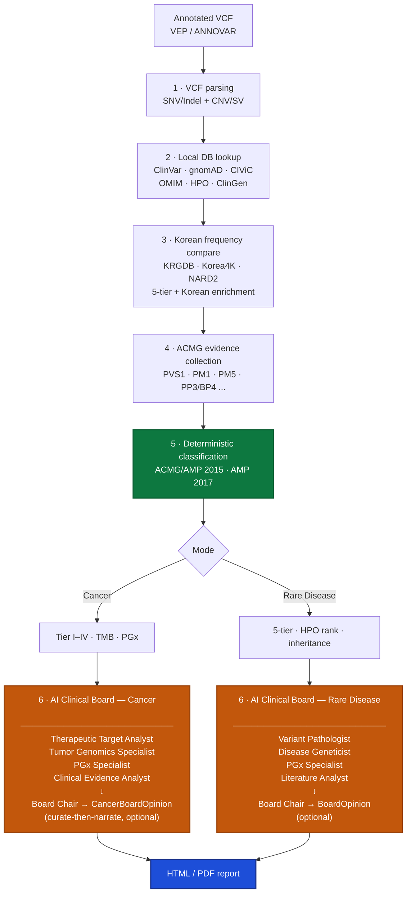

**Language:** [한국어](README.md) | English

# BIKO GenomeBoard

**Korean Population-Aware Genomic Variant Interpretation Platform**

   

> ⚠️ **Research reference only** — BIKO GenomeBoard produces research reference documents for clinicians to consult. It is **not a clinical decision instrument**. Every interpretation must be reviewed by a qualified clinician.

---

## What does this project do?

BIKO GenomeBoard takes an already-annotated VCF (VEP/ANNOVAR) and automatically produces a **Korean-patient-tuned clinical report** — designed to be skim-readable in the 15 minutes a clinician has between patients.

BIKO addresses four specific pain points:

1. **WGS/WES results flood in, but Korean-population-filtered outputs are needed.** gnomAD alone is less accurate for Korean patients. KRGDB, Korea4K, and NARD2 must be compared alongside gnomAD EAS/ALL for BA1/BS1/PM2 calls to be clinically meaningful.
2. **ACMG/AMP 2015 (germline) and AMP/ASCO/CAP 2017 (somatic) must be applied consistently.** Hand-computing evidence codes per case destroys reproducibility.
3. **Treatment rationale must carry PMIDs and must never hallucinate.** An LLM saying "futibatinib targets KRAS G12D" is not acceptable in a clinical context.
4. **Everything must run inside the hospital.** Uploading patient VCFs to a hosted API is a privacy non-starter.

BIKO satisfies all four in a **100% offline, on-premise** environment.

## Who is this for?

| Audience | Why this tool? |
|---|---|
| **Clinical geneticists / hemonc oncologists** | Turn annotated VCFs into readable reports immediately |
| **Bioinformatics researchers** | Bolt-on reporting layer for a WGS pipeline |
| **Korean-cohort researchers** | Pull KRGDB/Korea4K/NARD2 frequencies directly into the report |
| **Clinical genomics educators** | Transparent, inspectable example of how ACMG evidence codes combine |

**Restated disclaimer**: This is not a diagnostic instrument. Every generated report carries a "research use only" tag, and the final clinical decision must always be made by a qualified clinician.

## Pipeline flow



### Two core principles

**Principle 1 · Classification is 100% deterministic.** ACMG classification and AMP tiering run as pure Python rule engines — no LLM involved. The same VCF always yields the same result. Reproducibility is the point.

**Principle 2 · Treatment evidence is "curate first, narrate second".** Treatment options are deterministically curated from OncoKB + local CIViC, and the local LLM (MedGemma) is only allowed to *narrate* them. It is **structurally impossible** for the LLM to suggest a drug that is not in the curated list. A scrubber strips any unauthorised drug mentions from free-text fields as a second line of defence.

These two principles together mean LLM hallucinations cannot leak into variant classification or treatment recommendations. The LLM's job is explanation: "given this curated evidence, here is how to read it in this patient's context."

## Key features

### Analysis modes

| Mode | Guideline | Primary output |
|---|---|---|
| **Cancer (somatic)** | AMP/ASCO/CAP 2017 | Tier I–IV + TMB (mut/Mb) + treatment options + immunotherapy eligibility + PGx |
| **Rare Disease (germline)** | ACMG/AMP 2015 | 5-tier classification (P/LP/VUS/LB/B) + HPO phenotype ranking + inheritance (AD/AR/XL) |

### Feature list

- **5-tier Korean frequency comparison** — KRGDB + Korea4K + NARD2 + gnomAD EAS + gnomAD ALL compared simultaneously for BA1/BS1/PM2 calls; Korean enrichment ratio computed automatically
- **Deterministic ACMG engine** — 28 evidence codes, in silico thresholds (REVEL/CADD/AlphaMissense/SpliceAI → PP3/BP4), ClinVar expert panel override, PMID-backed PM1 hotspot table
- **AMP 2017 Tiering** — CIViC variant-level evidence + OncoKB + Cancer Hotspots + ClinVar Pathogenic
- **Curate-then-narrate treatment rationale** — OncoKB + CIViC deterministically curated with PMIDs; LLM narrates only
- **TMB calculation** — FoundationOne CDx methodology, High/Intermediate/Low auto-classification
- **CNV/SV analysis** — AnnotSV TSV → ACMG CNV 2020 Class 1–5
- **HPO phenotype ranking** — 329K+ gene-phenotype associations, offline SQLite
- **AI Clinical Board** — local MedGemma 27B (specialists) + SuperGemma4 31B (Board Chair) hybrid, Grounded Prompting, never alters the deterministic classification
- **PGx screening** — PharmCAT 3.2.0 integration + 24-gene Korean PGx table (CPIC Level A/B), Korean vs Western prevalence comparison
- **Germline VCF integration** — `--germline` flag enables joint somatic + germline analysis; inherited variants extracted against a ClinVar P/LP point-level BED
- **Trio / quartet support** — `--ped` flag (strict mode) resolves family roles from a PED file; trio FORMAT/GT enables automatic de-novo detection
- **De novo evidence** — in rare-disease mode, PS2/PM6 fire on confirmed/assumed de novo, DDG2P neurodevelopmental panel (2,201 genes) carve-out, SpliceAI ≥ 0.2 splice rescue
- **Variant selector** — deterministic pre-filter that decides which variants reach the AI Board (protein-impacting consequence gate, MMR/Lynch carve-out, clinical-priority sort)
- **100% offline** — all core databases local, external API calls are opt-in
- **Korean / English report output**
- **Report regeneration tool** — re-render HTML from a cached run JSON without calling Ollama again

### v2.4 highlights

v2.4 grew BIKO from a somatic-only tool into a **dual-input pipeline (somatic + germline)**:

| Area | Pre-v2.3 | v2.4 |
|---|---|---|
| Germline input | none | `--germline` VCF + ClinVar P/LP BED inherited-variant extraction |
| PGx | 12-gene builtin table only | PharmCAT 3.2.0 (Java 17 auto-install) + 24-gene builtin fallback |
| Trio | filename heuristic | `--ped` strict mode (trio/quartet), automatic de-novo PS2/PM6 |
| Rare-disease panel | OMIM-only | + DDG2P 2,201-gene neurodevelopmental panel carve-out |
| Board Chair | MedGemma single model | MedGemma 27B (specialists) + SuperGemma4 31B (Chair) hybrid |
| Report sort | classification rank | `(board_admitted, classification_rank, hpo_score, ...)` — Board picks float to top |

See the v2.3 / v2.4 section in [CLAUDE.md](CLAUDE.md) for implementation details.

### Sample reports (see them first)

Actual pipeline-generated HTML reports, hosted on GitHub Pages:

**🌐 Landing page: <https://junehawk.github.io/BIKO-GenomeBoard/>**

| Report | Input | Notes |
|---|---|---|
| [Cancer — synthetic demo](https://junehawk.github.io/BIKO-GenomeBoard/showcase/sample_cancer_report.html) | 5-variant VEP annotated (synthetic) | PGx + TMB + curated therapies |
| [Rare Disease — HPO-driven](https://junehawk.github.io/BIKO-GenomeBoard/showcase/sample_rare_disease_report.html) | 5-variant + 3 HPO phenotypes (synthetic) | HPO ranking + OMIM + ClinGen |
| [Project overview (detailed)](https://junehawk.github.io/BIKO-GenomeBoard/showcase/BIKO_GenomeBoard_소개.html) | — | Full feature walkthrough + tech stack (Korean) |

## Installation

### 1. Install dependencies

```bash
git clone git@github.com:junehawk/BIKO-GenomeBoard.git
cd BIKO-GenomeBoard
pip install -r requirements.txt
```

**Requirements**: Python ≥ 3.10, enough disk for gnomAD VCFs (~700 GB full, or chromosome-sliced).

**System-tool dependencies** (v2.4 PGx + germline path):

| Tool | Used for | Notes |
|---|---|---|
| `bcftools` | VCF normalisation / indexing | system package (apt/brew) |
| `tabix` (htslib) | BED-narrowed germline extraction, PharmCAT pre-filter | system package |
| `pysam` | gnomAD VCF tabix direct query | `pip install pysam` (in requirements) |
| **Java 17** | PharmCAT 3.2.0 runtime | auto-installed by the runner on first PharmCAT invocation |

The PharmCAT JAR is also auto-downloaded on first run and cached. If `--germline` is omitted, the PharmCAT path is skipped entirely and the builtin PGx table fallback is used.

> **No external LLM API keys required** — BIKO uses local Ollama + local databases only. `NCBI_API_KEY` is optional, for ClinVar API rate-limit relief.

### 2. Build local databases

```bash
bash scripts/setup_databases.sh
```

This script downloads and builds public databases automatically.

| Automated | Requires manual setup |
|---|---|
| ClinVar · gnomAD · CIViC · HPO · Orphanet · GeneReviews · Korea4K · NARD2 · KRGDB · cancerhotspots | OMIM genemap2 (account required) · ClinGen (web export) |

Manual steps are printed by the script. See [docs/SETUP.md](docs/SETUP.md) for details.

### 3. (Optional) AI Clinical Board

To use the AI Clinical Board, install [Ollama](https://ollama.com) and pull MedGemma 27B:

```bash
ollama pull alibayram/medgemma:27b
```

**The deterministic classification + report generation work fine without Ollama.** The AI Board is an additive layer.

## Usage

### Minimal cancer run

```bash
python scripts/orchestrate.py sample.vcf -o report.html --skip-api
```

`--skip-api` disables external API calls and uses only local databases.

### Rare disease mode with HPO phenotypes

```bash
python scripts/orchestrate.py patient.vcf --mode rare-disease \
  --hpo HP:0001250,HP:0001263 \
  -o report.html --skip-api
```

HPO terms drive the candidate-gene ranking.

### Germline VCF + trio (v2.4)

Pass a germline VCF and a PED file alongside the proband VCF to enable PharmCAT-driven PGx and trio-based de-novo detection:

```bash
python scripts/orchestrate.py proband.vcf.gz \
  --germline germline.vcf.gz \
  --ped family.ped \
  --mode rare-disease \
  --hpo HP:0001250,HP:0001263 \
  -o report.html --skip-api
```

- `--germline` — PharmCAT 3.2.0 runs automatically and the inherited-variant block is filled from a ClinVar P/LP point-level BED intersection. If omitted, the pipeline falls back to the builtin PGx table.
- `--ped` — strict-mode trio / quartet resolution. Any role that cannot be unambiguously resolved from the PED file raises immediately. If omitted, the parser falls back to filename heuristics (`*_proband.vcf`, `*_father.vcf`, ...).
- When the trio resolves, `parse_vcf` reads FORMAT/GT to flag de-novo variants and the ACMG engine fires PS2 / PM6. DDG2P neurodevelopmental-panel genes get an additional admission carve-out.

### With AI Clinical Board

```bash
python scripts/orchestrate.py sample.vcf --clinical-board --board-lang en \
  -o report.html --skip-api
```

MedGemma 27B runs the multi-specialist synthesis. Treatment options are only narrated from the OncoKB + CIViC curator output. Use `--board-lang ko` for Korean output.

### CNV/SV + InterVar integration

```bash
python scripts/orchestrate.py sample.vcf \
  --sv annotsv_output.tsv \
  --intervar intervar_output.tsv \
  -o report.html --skip-api
```

### Batch processing (parallel)

```bash
python scripts/orchestrate.py --batch vcf_dir/ \
  --output-dir reports/ --workers 8 --skip-api
```

### Clinical note injection

```bash
python scripts/orchestrate.py sample.vcf --clinical-board \
  --clinical-note "55yo male, former smoker, RUL mass, progression after 1st-line cytotoxic chemo" \
  -o report.html --skip-api
```

The clinical note is injected into the AI Board briefing only. It never touches the deterministic classification engine, and the raw text is not embedded in the rendered HTML (re-identification prevention).

### Docker

```bash
docker build -t biko-genomeboard .
docker run \
  -v ./data/db:/app/data/db \
  -v ./input:/app/input \
  -v ./output:/app/output \
  biko-genomeboard /app/input/sample.vcf -o /app/output/report.html --skip-api
```

## Testing

```bash
pip install -r requirements-dev.txt
python -m pytest tests/ -q
```

**901+ tests**, green CI on ubuntu-latest / Python 3.10 · 3.11 · 3.12. Coverage includes ACMG classification, in silico thresholds, ClinVar override, CIViC/OncoKB integration, TMB, CNV/SV, HPO matching, Korean frequency comparison, PGx, AI Clinical Board, variant selector, and report generation.

## Documentation

| Doc | Contents |
|---|---|
| [docs/SETUP.md](docs/SETUP.md) | Installation and database setup details |
| [docs/ARCHITECTURE.md](docs/ARCHITECTURE.md) | System architecture and data flow |
| [docs/KOREAN_STRATEGY.md](docs/KOREAN_STRATEGY.md) | Korean population analysis strategy |
| [docs/TIERING_PRINCIPLES.md](docs/TIERING_PRINCIPLES.md) | Variant tiering principles (Cancer + Rare Disease) |
| [CLAUDE.md](CLAUDE.md) | Agent working guide (Claude Code only) |

## License

MIT — see [LICENSE](LICENSE).

The AI Clinical Board feature uses [Google MedGemma](https://deepmind.google/models/gemma/medgemma/) under the [Gemma Terms of Use](https://ai.google.dev/gemma/terms) (MedGemma is governed by the Gemma terms). Model code: [google-health/medgemma](https://github.com/google-health/medgemma). MedGemma is not clinical-grade; this tool is for research assistance only.

---

<div align="center">

**BIKO GenomeBoard** — Korean Population-Aware Genomic Variant Interpretation Platform

Python ≥ 3.10 · Docker Ready · Offline Capable · Research Use Only

</div>
