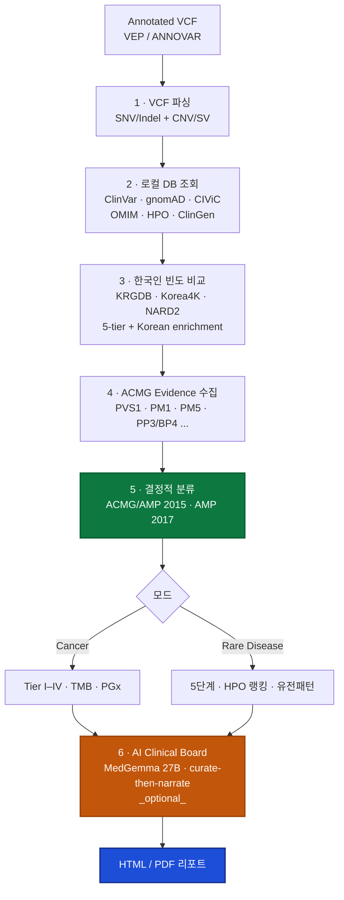

**언어:** 한국어 | [English](README.en.md)

# BIKO GenomeBoard

**한국인 집단 데이터 기반 유전체 변이 해석 플랫폼**

   

> ⚠️ **연구 참고용 문서** — BIKO GenomeBoard는 임상 참고 자료를 생성하며, **임상 의사결정 도구가 아닙니다.** 모든 해석은 반드시 자격을 갖춘 임상의의 검토를 거쳐야 합니다.

---

## 이 프로젝트는 무엇을 하나요?

이미 주석된 VCF 파일(VEP/ANNOVAR)을 입력으로 받아 **한국인 환자에게 최적화된 임상 리포트**를 자동 생성합니다. 의사가 다음 환자로 넘어가기 전 15분 안에 훑어볼 수 있도록 디자인되었습니다.

BIKO가 해결하려는 문제는 4가지입니다.

1. **WGS/WES 결과가 쏟아지지만 한국인 빈도로 필터링된 결과가 필요**합니다 — gnomAD만으로는 한국인 환자에게 덜 정확합니다. KRGDB·Korea4K·NARD2를 gnomAD EAS/ALL과 함께 비교해야 BA1/BS1/PM2 판정이 임상에 의미 있습니다.
2. **ACMG/AMP 2015(희귀질환)과 AMP/ASCO/CAP 2017(암) 가이드라인을 일관되게 적용**해야 합니다 — 사람이 매번 코드를 계산하면 reproducibility가 무너집니다.
3. **치료 근거는 환각 없이 PMID와 함께** 제시되어야 합니다 — LLM이 "KRAS G12D에는 futibatinib이 좋습니다" 같은 엉터리를 절대로 말하면 안 됩니다.
4. **병원 안에서 모든 게 돌아가야** 합니다 — 환자 VCF를 외부 API에 올리는 건 개인정보 관점에서 허용되지 않습니다.

BIKO는 이 4가지 요구를 **100% 오프라인·온프레미스** 환경에서 충족합니다.

## 누구를 위한 도구인가요?

| 사용자 | 왜 이 도구가 필요한가요? |
|---|---|
| **임상 유전학자 / 혈액종양내과** | 이미 주석된 VCF를 곧바로 읽히는 리포트로 |
| **바이오인포매틱스 연구자** | WGS 파이프라인 뒤에 붙이는 리포트 자동화 계층 |
| **한국인 코호트 연구자** | KRGDB/Korea4K/NARD2 빈도를 리포트에 직접 반영 |
| **임상 유전체 교육자** | ACMG evidence code가 어떤 식으로 조합되는지 보여주는 투명한 예시 |

**재차 강조**: 이 도구는 진단 장비가 아닙니다. 생성된 리포트는 "연구용 참고 자료" 태그와 함께 출력되며, 실제 임상 결정은 반드시 자격을 갖춘 임상의가 내려야 합니다.

## 파이프라인 흐름



### 두 가지 핵심 원칙

**원칙 1 · 분류는 100% 결정적** — ACMG 분류와 AMP Tier 결정은 LLM을 전혀 사용하지 않는 Python 규칙 엔진으로 동작합니다. 같은 VCF를 몇 번을 돌려도 같은 결과가 나옵니다. 재현성이 핵심입니다.

**원칙 2 · 치료 근거는 "큐레이션 먼저, 설명은 나중에"** — 치료 옵션은 OncoKB + 로컬 CIViC에서 결정적으로 수집된 후에만 로컬 LLM(MedGemma)이 *설명*할 수 있습니다. 큐레이션된 목록에 없는 약물을 LLM이 제안하는 것은 **구조적으로 불가능**합니다. 스크러버가 자유 문장에서도 허용되지 않은 약물명을 제거합니다.

이 두 원칙 덕분에 LLM 환각은 변이 분류나 치료 추천에 영향을 주지 못합니다. LLM은 "이 근거를 이 환자 맥락에서 이렇게 해석하면 됩니다"라는 *설명*만 담당합니다.

## 주요 기능

### 분석 모드

| 모드 | 가이드라인 | 주요 출력 |
|---|---|---|
| **Cancer (체세포)** | AMP/ASCO/CAP 2017 | Tier I–IV + TMB(mut/Mb) + 치료 옵션 + 면역치료 적합성 + PGx |
| **Rare Disease (생식세포)** | ACMG/AMP 2015 | 5단계 분류(P/LP/VUS/LB/B) + HPO 표현형 랭킹 + 유전패턴(AD/AR/XL) |

### 기능 목록

- **한국인 빈도 5-tier 비교** — KRGDB + Korea4K + NARD2 + gnomAD EAS + gnomAD ALL을 동시에 비교해 BA1/BS1/PM2 판정, Korean enrichment ratio 자동 계산
- **결정적 ACMG 엔진** — 28개 evidence code, in silico threshold(REVEL/CADD/AlphaMissense/SpliceAI → PP3/BP4), ClinVar expert panel override, PMID 기반 PM1 hotspot 테이블
- **AMP 2017 Tiering** — CIViC variant-level evidence + OncoKB + Cancer Hotspots + ClinVar Pathogenic
- **치료 근거 curate-then-narrate** — OncoKB + CIViC로부터 PMID와 함께 결정적으로 큐레이션, LLM은 설명만 담당
- **TMB 계산** — FoundationOne CDx 방법론, High/Intermediate/Low 자동 분류
- **CNV/SV 분석** — AnnotSV TSV → ACMG CNV 2020 Class 1–5
- **HPO 표현형 랭킹** — 329K+ 유전자-표현형 연관, 오프라인 SQLite
- **AI Clinical Board** — 로컬 MedGemma 27B 기반 다전문가 시스템(4 전문의 + Board Chair), Grounded Prompting, 결정적 분류는 절대 변경하지 않음
- **PGx 스크리닝** — 12개 유전자, CPIC Level A/B, 한국인 vs 서양인 유병률 비교
- **변이 선별기** — AI Board에 들어갈 변이를 AMP/ACMG 기준으로 결정적으로 선별(protein-impacting gate, MMR/Lynch carve-out 포함)
- **100% 오프라인** — 모든 핵심 DB가 로컬, 외부 API 호출은 선택 사항
- **한국어/영어 리포트**
- **리포트 재생성 도구** — 캐시된 JSON에서 Ollama 재호출 없이 HTML을 다시 렌더링

### 샘플 리포트 (직접 보기)

출력물이 어떤 느낌인지 먼저 확인하세요:

| 리포트 | 입력 | 특징 |
|---|---|---|
| [Cancer — 합성 데모](docs/showcase/sample_cancer_report.html) | 5-variant VEP annotated | PGx + TMB + 치료 큐레이션 |
| [Cancer — 실제 WGS (777 변이)](docs/showcase/sample_codegen_777_report.html) | `codegen-Tumor_WB.mutect.passed.vep.vcf` | 777 → 3 변이 선별, KRAS G12D 드라이버 |
| [Rare Disease — HPO 기반](docs/showcase/sample_rare_disease_report.html) | 5-variant + 3 HPO 표현형 | HPO 랭킹 + OMIM + ClinGen |
| [프로젝트 소개 (상세)](docs/showcase/BIKO_GenomeBoard_소개.html) | — | 기능 전체 설명 + 기술 스택 |

## 설치

### 1. 의존성 설치

```bash
git clone git@github.com:junehawk/BIKO-GenomeBoard.git
cd BIKO-GenomeBoard
pip install -r requirements.txt
```

**요구사항**: Python ≥ 3.10, 충분한 디스크 공간(gnomAD VCF 전체 ~700GB, 또는 염색체별 선택).

### 2. 로컬 데이터베이스 빌드

```bash
bash scripts/setup_databases.sh
```

이 스크립트는 공공 데이터베이스를 자동으로 내려받고 빌드합니다.

| 자동 설치 | 수동 설치 필요 |
|---|---|
| ClinVar · gnomAD · CIViC · HPO · Orphanet · GeneReviews · Korea4K · NARD2 · KRGDB · cancerhotspots | OMIM genemap2 (계정 필요) · ClinGen(웹 내보내기) |

수동 설치 경로는 스크립트 출력에 안내됩니다. 자세한 단계는 [docs/SETUP.md](docs/SETUP.md)를 참조하세요.

### 3. (선택) AI Clinical Board

AI Clinical Board를 사용하려면 [Ollama](https://ollama.com)를 설치하고 MedGemma 27B를 내려받습니다:

```bash
ollama pull alibayram/medgemma:27b
```

Ollama 없이도 **결정적 분류 + 리포트 생성은 정상 동작**합니다. AI Board는 추가 계층일 뿐입니다.

## 사용법

### 가장 기본: 암 모드

```bash
python scripts/orchestrate.py sample.vcf -o report.html --skip-api
```

`--skip-api`는 외부 API 호출을 막고 로컬 DB만 사용합니다.

### 희귀질환 모드 + HPO 표현형

```bash
python scripts/orchestrate.py patient.vcf --mode rare-disease \
  --hpo HP:0001250,HP:0001263 \
  -o report.html --skip-api
```

HPO 표현형은 후보유전자 랭킹에 사용됩니다.

### AI Clinical Board 포함

```bash
python scripts/orchestrate.py sample.vcf --clinical-board --board-lang ko \
  -o report.html --skip-api
```

MedGemma 27B가 다전문가 종합 추론을 수행하고, 치료 옵션은 OncoKB+CIViC에서 큐레이션된 것만 narrate합니다. `--board-lang en`으로 영어 출력도 가능합니다.

### CNV/SV + InterVar 통합

```bash
python scripts/orchestrate.py sample.vcf \
  --sv annotsv_output.tsv \
  --intervar intervar_output.tsv \
  -o report.html --skip-api
```

### 배치 처리 (병렬)

```bash
python scripts/orchestrate.py --batch vcf_dir/ \
  --output-dir reports/ --workers 8 --skip-api
```

### 임상 노트 주입

```bash
python scripts/orchestrate.py sample.vcf --clinical-board \
  --clinical-note "55세 남성, 이전 흡연력, 우상엽 종괴, 1차 세포독성 화학요법 후 진행" \
  -o report.html --skip-api
```

임상 노트는 AI Board 브리핑에만 주입되며, 결정적 분류 엔진에는 영향을 주지 않습니다. 리포트 HTML에는 원문이 포함되지 않습니다(재식별 방지).

### Docker

```bash
docker build -t biko-genomeboard .
docker run \
  -v ./data/db:/app/data/db \
  -v ./input:/app/input \
  -v ./output:/app/output \
  biko-genomeboard /app/input/sample.vcf -o /app/output/report.html --skip-api
```

## 테스트

```bash
pip install -r requirements-dev.txt
python -m pytest tests/ -q
```

**901+ 테스트**, ubuntu-latest / Python 3.10·3.11·3.12 CI 녹색. ACMG 분류, in silico threshold, ClinVar override, CIViC/OncoKB 통합, TMB, CNV/SV, HPO 매칭, 한국인 빈도 비교, PGx, AI Clinical Board, 변이 선별기, 리포트 생성 모두 커버합니다.

## 문서

| 문서 | 내용 |
|---|---|
| [docs/SETUP.md](docs/SETUP.md) | 설치 및 데이터베이스 설정 상세 |
| [docs/ARCHITECTURE.md](docs/ARCHITECTURE.md) | 시스템 아키텍처 및 데이터 흐름 |
| [docs/KOREAN_STRATEGY.md](docs/KOREAN_STRATEGY.md) | 한국인 인구집단 분석 전략 |
| [docs/TIERING_PRINCIPLES.md](docs/TIERING_PRINCIPLES.md) | 변이 Tiering 원칙 (Cancer + Rare Disease) |
| [CLAUDE.md](CLAUDE.md) | AI 에이전트 작업 가이드 (Claude Code 전용) |

## 라이선스

MIT — 자세한 내용은 [LICENSE](LICENSE).

AI Clinical Board 기능은 [Google MedGemma](https://deepmind.google/models/gemma/medgemma/)를 [Gemma Terms of Use](https://ai.google.dev/gemma/terms) 하에 사용합니다 (MedGemma는 Gemma 약관 적용). 모델 코드: [google-health/medgemma](https://github.com/google-health/medgemma). MedGemma는 임상 등급이 아니며, 이 도구는 연구 보조 용도로만 사용됩니다.

---

<div align="center">

**BIKO GenomeBoard** — Korean Population-Aware Genomic Variant Interpretation Platform

Python ≥ 3.10 · Docker Ready · Offline Capable · Research Use Only

</div>
